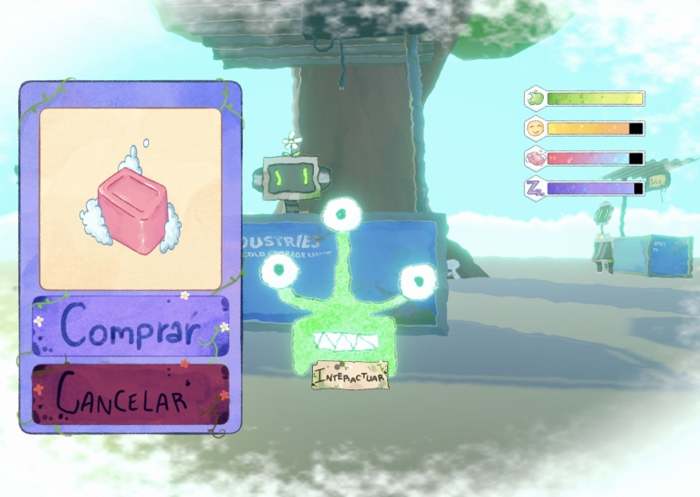
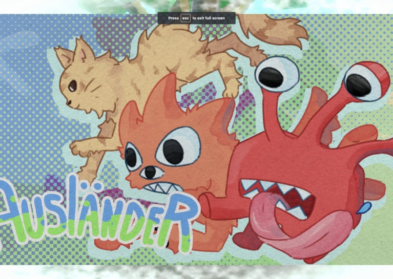
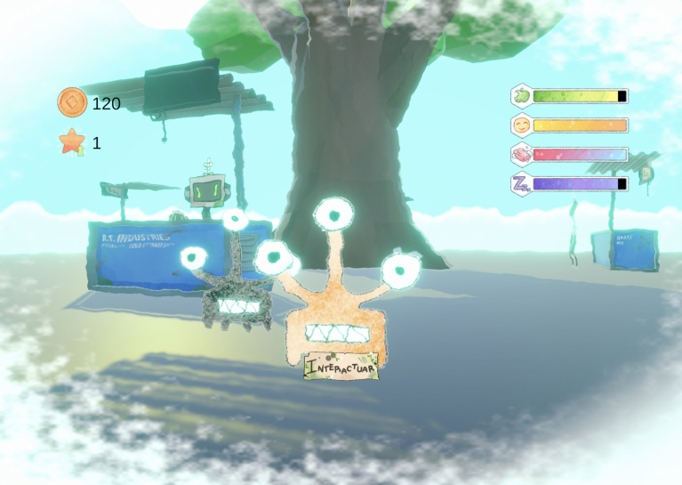

# 🪐 Ausländer – Global Game Jam 2023

**Ausländer** is a multiplayer simulation game developed during the [Global Game Jam 2023](https://v3.globalgamejam.org/2023/games/ausländer-8), inspired by children's MMOs like *Club Penguin*. In this world, animals have been exposed to a toxic environment, and your mission is to take care of them, feed them, and help them return to their roots.

> "In Ausländer the animals were exposed to a toxic environment. You can save them by buying groceries to improve their stats and return them to their ROOTS."

---

## 🌱 Main Features

- 🧼 Buy items to improve creature stats
- 👀 Third-person perspective
- 👨‍👩‍👧‍👦 Multiplayer support using **Photon Engine**
- 🌐 Web-based gameplay (WebGL - page currently disabled)
- 🎨 Visual style with watercolor-like textures to evoke a soft, childlike atmosphere
- 🧙‍♂️ Experimental use of shaders to enhance visual presentation

---

## 🕹️ Gameplay

  
  
  


---

## 🛠️ Technology

- Engine: [Unity](https://unity.com/)
- Multiplayer: [Photon Engine](https://www.photonengine.com/)
- Target platform: WebGL (playable in browser)

---

## 🧑‍💻 Team

- 🎵 **Jose Arce** – Music and voices  
- 🎨 **Maria Fernanda Cerdas** – Art  
- 🛠️ **Victor Castrillo** – Unity Development  
- 🛠️ **Gabriel Abarca** – Unity Development and Deployment

---

## 📦 Project Status

This repository is archived and not actively maintained. It was created as a jam entry with no current plans for expansion or external contributions.

---

## 📁 Folder Structure

```
GameJam-2023/
├── Assets/              # Unity assets (art, scripts, prefabs, etc.)
├── Packages/            # Project dependencies
├── ProjectSettings/     # Unity configuration files
├── images/              # Screenshots used in the README
├── README.md            # This file
└── ...
```

---
## 📝 License

This project is licensed under the **Creative Commons Attribution-NonCommercial 4.0 International (CC BY-NC 4.0)**.

You are free to:

- ✅ Share — copy and redistribute the material in any medium or format
- ✅ Adapt — remix, transform, and build upon the material

Under the following terms:

- **Attribution** — You must give appropriate credit.
- **NonCommercial** — You may not use the material for commercial purposes.

See the full license text here: [CC BY-NC 4.0](https://creativecommons.org/licenses/by-nc/4.0/)
---
## 💡 Extra Credits

Made with ❤ during Global Game Jam 2023.
